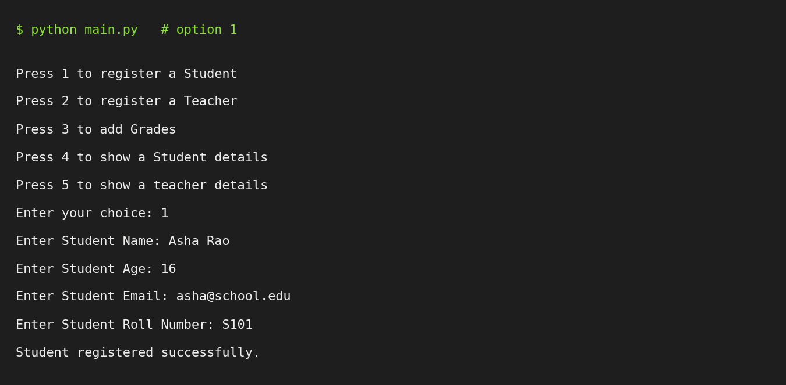
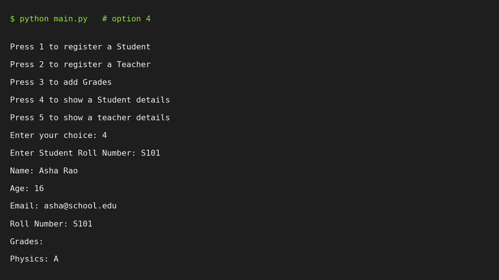

# School Management System

A console-based Python application for managing school records: register students and teachers, record student grades, and look up details, with all data stored permanently in a JSON file.

Built as the **VITyarthi – Build Your Own Project** submission, applying object-oriented programming concepts (abstraction, inheritance, polymorphism, encapsulation) and file-based persistence.

## Overview

Schools often track students, teachers and marks on paper or in scattered spreadsheets. This project provides a small, easy-to-run system that keeps this information in one place. The user picks an option from a numbered menu, answers a few prompts, and the system validates the input, updates the record and saves it to disk.

## Features

| Module | Feature |
|---|---|
| **Student management** | Register a student (name, age, email, roll number) with email validation and duplicate roll-number check |
| **Teacher management** | Register a teacher (name, age, email, subject, employee ID) with email validation and duplicate employee-ID check |
| **Grades & records** | Add subject-wise grades to a student; view a full student profile with grades; view a teacher profile |
| **Persistence** | Every change is saved to `School_data.json` and reloaded on the next start |
| **Testing** | 25 automated unit tests (standard-library `unittest`) |

## Technologies Used

- **Python 3.8+** (standard library only – no external packages to install)
- `abc` – abstract base class for the OOP design
- `json` / `pathlib` – file-based storage
- `unittest` + `unittest.mock` – testing
- Graphviz and matplotlib – only used to *generate the design diagrams* (optional)
- Git / GitHub – version control

## Project Structure

```
school-management-system/
├── main.py                  # Entry point
├── school_mgmt/
│   ├── __init__.py
│   ├── menu.py              # Console menu and routing of choices
│   ├── persons.py           # Abstract base class `persons` + email validation
│   ├── student.py           # Student: register, add grades, show details
│   ├── teacher.py           # Teacher: register, show details
│   └── storage.py           # JSON load / save
├── tests/
│   └── test_school.py       # 25 unit tests
├── docs/
│   ├── diagrams/            # Architecture, workflow, use case, class, sequence, ER diagrams
│   ├── screenshots/         # Terminal screenshots of real runs
│   └── Project_Report.pdf   # Detailed project report
├── statement.md             # Problem statement, scope, users, features
├── README.md
├── requirements.txt
└── .gitignore
```

## How to Install and Run

1. Make sure Python 3.8 or newer is installed: `python --version`
2. Clone the repository and move into it:
   ```bash
   git clone <your-repository-url>
   cd school-management-system
   ```
3. Run the program:
   ```bash
   python main.py
   ```
4. Choose an option:
   ```
   Press 1 to register a Student
   Press 2 to register a Teacher
   Press 3 to add Grades
   Press 4 to show a Student details
   Press 5 to show a teacher details
   ```

The program performs one action per launch. Data is kept in `School_data.json` (created automatically in the folder you run the program from), so records added in one run are available in the next.

## Instructions for Testing

From the project root:

```bash
python -m unittest discover -s tests -v
```

The tests use a temporary file, so your real `School_data.json` is never touched. They cover email validation, the abstract base class, student and teacher registration (success, invalid email, duplicate ID), grade entry, detail display, persistence to disk, and menu routing.

## Screenshots

| Register student | Show student details |
|---|---|
|  |  |

More in [`docs/screenshots/`](docs/screenshots/), including duplicate/invalid input handling, the JSON data file, and the unit-test run.

## Design Diagrams

Architecture, workflow, use case, class, sequence and ER diagrams are in [`docs/diagrams/`](docs/diagrams/) and explained in the project report. To regenerate them: `python docs/diagrams/generate_diagrams.py` (needs Graphviz and matplotlib).

## Known Limitations

Documented honestly so they can be addressed in future versions:

- Entering a non-numeric age or menu choice raises a `ValueError` (input is not yet wrapped in `try/except`).
- The teacher registration prompts say "Student Name / Age / Email" (wording only; data is stored correctly as a teacher).
- Viewing a student or teacher who does not exist prints nothing.
- Email validation is a basic check (`@` and `.` present).
- One action per launch; no edit or delete operations yet.

## License

Academic project – for educational use.
